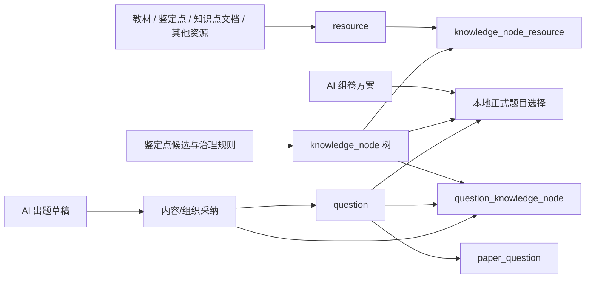

# Knowledge Node Resource AI Closure Plan

## Purpose

本文件把知识点树、知识点文档、教材等资源、题目，以及四类高级版 AI 出题和 AI 组卷中的知识点参数闭环物化为后续源码整改依据。它只定义目标关系、任务拆分和验收边界，不改数据库、账号、fixture、Provider、env、package、lockfile、schema、migration、seed。

## SSOT Read List

- `AGENTS.md`
- `docs/04-agent-system/state/project-state.yaml`
- `docs/04-agent-system/state/task-queue.yaml`
- `docs/03-standards/code-taste-ten-commandments.md`
- `docs/03-standards/ui-code.md`
- `docs/02-architecture/adr/adr-001-tech-stack-selection.md`
- `docs/02-architecture/adr/adr-002-runtime-architecture-and-multi-client-contract.md`
- `docs/02-architecture/adr/adr-003-workplace-desktop-web-compatibility.md`
- `docs/02-architecture/adr/adr-004-environment-isolation-and-release-boundaries.md`
- `docs/02-architecture/adr/adr-005-staging-architecture-and-release-boundaries.md`
- `docs/02-architecture/adr/adr-006-runtime-dependency-alignment.md`
- `docs/02-architecture/adr/adr-007-edition-aware-authorization-source-of-truth.md`
- `docs/01-requirements/00-index.md`
- `docs/01-requirements/advanced-edition/00-index.md`
- `docs/01-requirements/advanced-edition/edition-aware-authorization-requirements.md`
- `docs/01-requirements/modules/05-rag-knowledge.md`
- `docs/01-requirements/modules/02-question-paper.md`
- `docs/01-requirements/advanced-edition/modules/02-ai-task-domain.md`
- `docs/01-requirements/advanced-edition/modules/03-personal-ai-generation.md`
- `docs/01-requirements/advanced-edition/modules/08-organization-ai-generation.md`
- `docs/01-requirements/traceability/2026-07-02-ai-generation-requirements-ssot-alignment.md`
- `docs/01-requirements/traceability/2026-07-02-phase4-requirements-agent-baseline-alignment.md`
- `docs/01-requirements/traceability/2026-07-05-ai-generation-closed-loop-target-alignment.md`
- `docs/01-requirements/traceability/2026-07-06-ai-generation-recontract-requirements-materialization.md`
- `docs/01-requirements/traceability/2026-07-07-full-role-uiux-source-implementation-entry.md`
- `docs/01-requirements/traceability/2026-07-02-ui-ux-requirement-design-baseline-gap-analysis.md`
- `D:\tiku-local-private\owner-facing-fixtures\2026-06-28-rawfiles-curated\resource-pack-manifest.json`（只登记脱敏路径、数量和结论）
- `D:\tiku-local-private\owner-facing-fixtures\2026-06-28-rawfiles-curated\source-coverage.csv`（只登记脱敏路径、来源覆盖结论）
- `D:\tiku-local-private\owner-facing-fixtures\2026-06-28-rawfiles-curated\knowledge-node-candidates.csv`（只登记脱敏路径、分专业候选数量）

## Current Code Baseline

- `knowledge_node` 是当前代码里的知识点树实体，挂在 `knowledge_base` 下，含 `public_id`、父节点、专业、等级列表、名称、路径、深度、排序、状态、是否推荐等字段。
- `resource` 是教材、鉴定点、知识点文档等学习或知识库资源实体，和 `knowledge_node` 通过 `knowledge_node_resource` 建立支持关系。
- `question` 和知识点树通过 `question_knowledge_node` 建立正式题目绑定；`paper_question` 只负责试卷内题目快照和排序，不应承载知识点主关系。
- 当前导入逻辑只从题目行里的单个知识点名称生成或绑定知识点，资源到知识点的关系存在“按专业找第一个节点”的粗粒度映射风险。
- 当前 RAG 资源检索按资源状态、专业、等级、资源授权过滤，没有按已选择的知识点树或 `knowledge_node_resource` 收窄。
- 当前 AI 出题/组卷共享参数仍以 `knowledgeNode: string | null` 为主，学员端传 `null`，后台端输入自由文本或覆盖模式文案。
- 当前 AI 组卷已完成关键重订约：Provider 只产出组卷方案，本地服务从正式题目源选择题目；仍需让知识点范围成为源过滤和组卷 section 的强约束。
- 当前内容后台 AI 出题采纳草稿时没有把已选择或解析出的知识点绑定写入 `knowledgeNodePublicIds`。

## Target Relationship Model



关系定义：

- 知识点树是可治理的专业能力结构，不能把知识点文档、教材章节或单份资源等同为树节点。
- 教材、鉴定点、知识点文档等都先作为 `resource`；它们通过 `knowledge_node_resource` 表明“该资源支持哪些知识点”。
- 题目通过 `question_knowledge_node` 表明“该正式题考查哪些知识点”。
- AI 出题草稿只有在内容后台或组织后台采纳为正式或训练内容时，才把结构化知识点绑定落到题目关系。
- AI 组卷只消费正式题目及其知识点绑定，不让模型直接生成最终题目正文、选项、答案或解析。

## Relationship Establishment Timing

1. 知识点树建立：在资源包或人工治理导入阶段，从鉴定点候选和治理规则生成 `knowledge_node`，保留专业、等级、父子、路径、排序和可推荐状态。后续源码任务只能使用现有表结构，不新增 schema。
2. 资源关联建立：在资源导入、发布、重建 RAG 或资源编辑保存时，用确定性解析器把资源标题、来源类型、专业、等级、候选映射和人工选择解析成 `knowledge_node_resource`；禁止再使用“同专业第一个节点”作为有效关联。
3. 题目关联建立：在题目录入、题目导入、AI 出题采纳、AI 推荐绑定确认时写入 `question_knowledge_node`；题目列表和组卷服务只读取正式绑定。
4. AI 请求关联：用户选择知识点时传结构化 public id 列表和覆盖模式；服务端扩展子孙节点后把范围用于资源检索、题源过滤、组卷 section 和采纳绑定。

## Four-Role AI Knowledge Parameter Contract

统一参数形态：

```ts
type KnowledgeNodeMode =
  | "balanced"
  | "selected"
  | "weak_point_priority"
  | "comprehensive";

type KnowledgeScopeInput = {
  knowledgeNodeMode: KnowledgeNodeMode;
  knowledgeNodePublicIds: string[];
  includeDescendants: boolean;
  knowledgeNodeSupplement: string | null;
  sourcePreference?: "balanced" | "prefer_platform" | "prefer_enterprise";
};
```

落地规则：

- 个人高级版学员：AI 出题和 AI 组卷必须使用个人授权范围；标准版展示拒绝或升级提示；选中知识点为空时显示空态并允许均衡覆盖模式。
- 企业高级版员工：AI 出题和 AI 组卷必须使用组织上下文、员工权限和同组织资源边界；缺组织上下文时禁用提交。
- 企业高级版管理员：组织后台 AI 出题和 AI 组卷只输出组织训练草稿或本地组卷结果；企业资源只在同组织边界内参与。
- 内容后台：AI 出题进入内容草稿、待审、采纳闭环；AI 组卷只能从平台正式题目源本地选择；知识点绑定必须随采纳落到正式题关系。

## AI Question Flow

1. UI 提交结构化知识点参数。
2. 服务端校验角色、授权、edition、组织上下文和知识点可见性。
3. 服务端解析知识点子树范围，按 `knowledge_node_resource` 收窄资源和 chunk。
4. 证据状态为 sufficient 时允许生成；weak 时显示降级提示；none 时禁用或返回清晰错误。
5. AI 出题草稿只保存脱敏摘要和结构化字段；采纳时写入 `question_knowledge_node`。

## AI Paper Flow

1. UI 提交结构化知识点参数和题量、难度、题型、来源偏好。
2. Provider 只生成组卷方案，不生成最终题目正文、选项、答案或解析。
3. 本地服务按角色可见题源、专业、等级、科目、题型、难度、知识点范围过滤正式题。
4. 组卷 section 的 exact / nearby / same_scope 规则必须把“知识点为空”和“知识点不足”区分开；空范围不能被误判为 exact 命中。
5. 题源不足时返回不足状态、缺口摘要和可操作建议，不自动越权扩大来源。

## Implementation Order

1. 先完成本文件、总控矩阵、task plan、evidence、三轮 audit 的登记和验证。
2. 再从最新 `origin/master` 按矩阵逐短分支实现，每个分支只处理当前核销项。
3. 每个分支先读相关规范、需求、代码和矩阵行，后写测试，再做最小实现。
4. 每个分支完成后提交、快进合入 master、在 master 跑门禁、推送、删除短分支、确认 clean 和远端对齐。
5. 最终做全角色一致性回归，确认四类 AI 场景和知识点树/资源/题目关系闭环。

## Non-Negotiable Boundaries

- 不改变登录、角色、授权、edition 判定语义。
- 不新增账号，不写数据库，不改 seed，不改 fixture。
- 不执行 Provider-enabled 调用。
- 不改 package、lockfile、schema、migration、seed。
- 不暴露内部数字 id、凭证、浏览器会话、env 值、DB 连接信息、数据库原始行、Provider payload、原始提示词、原始模型输出、完整题目、完整试卷、完整材料或完整资源内容。
- super_admin 缺组织上下文时不得误进组织业务页。
- content admin 仍只走草稿、待审、采纳闭环。
- ops_admin 与 super_admin 的运营后台入口边界不混淆。
