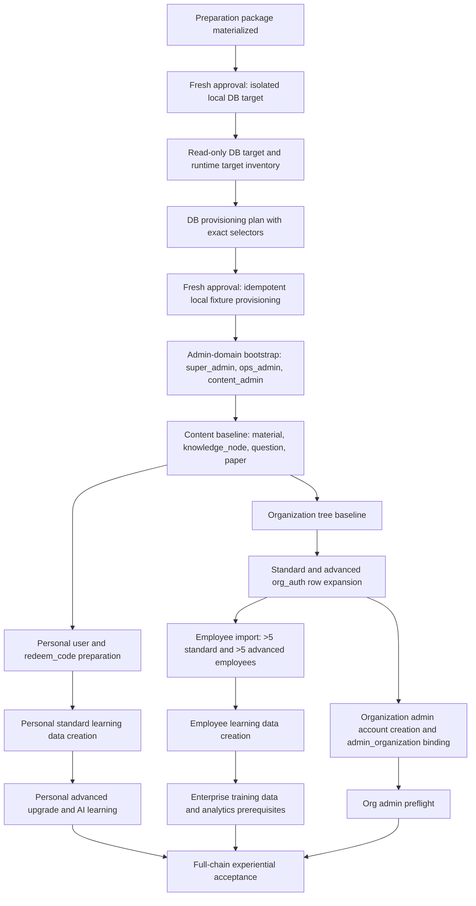

# Full Chain Acceptance Dependency DAG

Task id: `full-chain-acceptance-planning-and-materials-prep-2026-07-04`

Status: dependency plan only.

## DAG

## Hard Dependency Rules

| Rule | Dependency                                              | Reason                                                                                        |
| ---- | ------------------------------------------------------- | --------------------------------------------------------------------------------------------- |
| D01  | Isolated DB target before any provisioning              | Current local DB must not become the full-chain baseline by accident.                         |
| D02  | DB target alignment before app runtime validation       | Runtime app DB and provisioning DB must be the same target.                                   |
| D03  | `super_admin` before `ops_admin` and `content_admin`    | Backend role creation and role ownership start from system administration.                    |
| D04  | Content before AI generation and learning               | AI出题/AI组卷, practice, mock, and training need material/knowledge/question/paper context.   |
| D05  | Organization tree before org admin and employee binding | `admin_organization`, `employee`, and `org_auth_organization` need target organization nodes. |
| D06  | `org_auth` before employee access validation            | Employee access is derived from active organization authorization scopes.                     |
| D07  | Employee learning/training data before analytics        | Organization analytics is not meaningful before more than 5 employees generate activity.      |
| D08  | Standard personal auth before upgrade card redemption   | `edition_upgrade` requires matching active standard `personal_auth`.                          |
| D09  | Provider/Cost approval before any real AI execution     | AI generation and AI组卷 can create cost and sensitive payload risks.                         |
| D10  | Redacted preflight before browser/e2e acceptance        | Missing fixtures must stop execution before experiential validation starts.                   |

## Preparation Stages

| Stage | Name                          | Output                                                                 | Execution status                |
| ----- | ----------------------------- | ---------------------------------------------------------------------- | ------------------------------- |
| P0    | Docs-only preparation package | This task's acceptance docs, evidence, audit, state, queue             | Executed by this task           |
| P1    | Isolated DB approval          | Fresh approval text, proposed DB label, no connection yet              | Future task                     |
| P2    | Read-only target inventory    | Runtime DB target and schema/readiness labels                          | Future task                     |
| P3    | Provisioning plan             | Exact selectors, idempotent upsert scope, blocked operations           | Future task                     |
| P4    | Provisioning execution        | Local-only fixture rows, redacted aggregate evidence                   | Future task with fresh approval |
| P5    | Preflight                     | Account, org, auth, employee, content, paper, card, training readiness | Future task                     |
| P6    | Experiential acceptance       | Browser/e2e plus selector-scoped read-only DB evidence                 | Future task with fresh approval |

## Stop Rules

- Stop if runtime DB target differs from the approved isolated DB target.
- Stop if any private account source is missing or cannot be read by the approved future task.
- Stop if employee imports do not exceed 5 employees per standard/advanced organization.
- Stop if employee import templates contain `profession`, `level`, `subject`, `edition`, `orgAuthId`, `orgAuthScopePublicId`,
  or internal id columns.
- Stop if a commercial multi-scope enterprise package cannot be expanded into current-schema atomic `org_auth` rows.
- Stop if any standard role can access advanced-only AI or enterprise training capabilities.
- Stop if any evidence would expose private values or full content.

## Non-Claims

This DAG does not approve DB creation, provisioning, Provider use, browser/e2e execution, staging, production, Cost
Calibration, final Pass, or release readiness.
