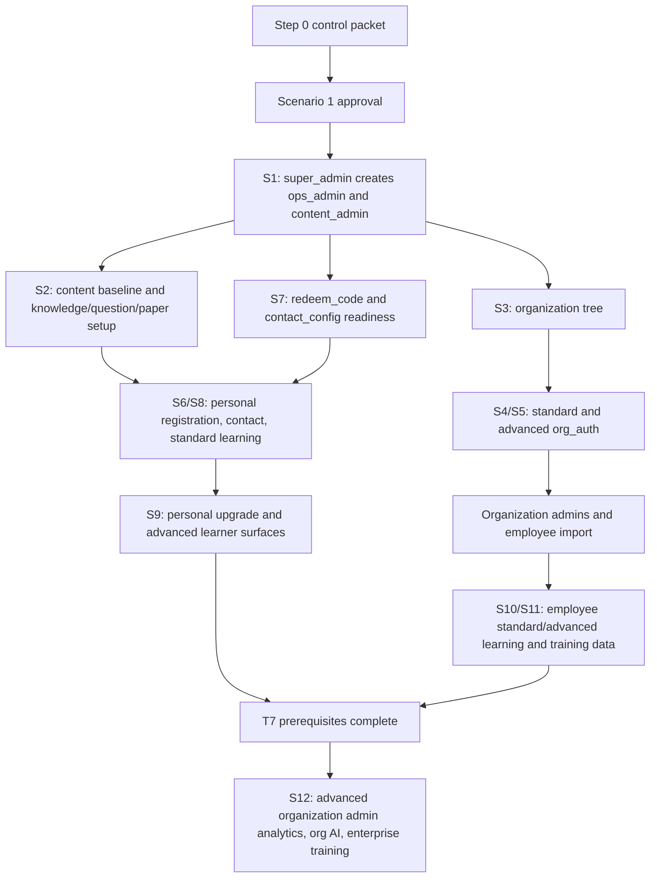

# Full Chain Goal Control And Coverage Ledger

Task id: `full-chain-goal-control-ledger-2026-07-04`

Status: docs-only control packet.

## Goal Objective

Serially prepare and execute full-role, full-chain local experiential acceptance while preserving project governance,
evidence redaction, Git isolation, and stop-on-fail rules. Ordinary fail/block outcomes do not end the goal; they stop
the active acceptance task and create a minimal repair or provisioning task before rerun.

This packet is Step 0 only. It does not run browser/e2e, start a dev server, read or mutate DB data, call Provider, read
private credential values, or claim runtime acceptance.

## Coverage Matrix

| Track                                                     | Primary scenarios | Required creation proof                                                                                                                           | Required negative/boundary proof                                                                                                           | Later approval class                                           |
| --------------------------------------------------------- | ----------------- | ------------------------------------------------------------------------------------------------------------------------------------------------- | ------------------------------------------------------------------------------------------------------------------------------------------ | -------------------------------------------------------------- |
| T1 Platform role bootstrap                                | 1                 | `super_admin` creates `ops_admin` and `content_admin` through the approved runtime flow.                                                          | Admin account domain stays separate from learner/employee domain; no organization, card, content, or learner output is pre-created.        | Scenario 1 fresh approval.                                     |
| T2 Content production and AI content governance           | 2                 | `content_admin` uploads material, builds knowledge nodes, creates question/paper baseline, and uses draft/review AI surfaces only after approval. | `content_admin` cannot operate global users, organizations, cards, or Provider/cost governance.                                            | Content browser/e2e; Provider/Cost fresh approval for real AI. |
| T3 Organization tree, authorization, and account delivery | 3, 4, 5, 7        | `ops_admin` creates organization tree, standard/advanced `org_auth`, org admins, employee imports, and card requests.                             | Employee import has no authorization fields; `org_standard_admin` has no advanced enterprise training or org AI.                           | Browser/e2e plus selector-scoped DB aggregate proof.           |
| T4 Personal standard learner chain                        | 6, 8              | Ordinary user registers, sees contact path, redeems standard card, and creates learning data.                                                     | No-auth user is not bounced into an unstable loop; standard user cannot access advanced AI.                                                | Browser/e2e plus redacted auth/learning aggregates.            |
| T5 Personal advanced learner chain                        | 9                 | Standard user redeems upgrade card or uses direct advanced path and reaches advanced learner AI surfaces after approval.                          | `edition_upgrade` writes upgrade state and does not create a second personal authorization; generated content stays learner-owned.         | Provider/Cost fresh approval for real AI.                      |
| T6 Enterprise employee learning chain                     | 10, 11            | Standard and advanced employees produce learning/training data after org auth and import.                                                         | Standard employee cannot access enterprise training or advanced AI; employee answers stay hidden from org admins except allowed summaries. | Browser/e2e; Provider/Cost approval for real AI/scoring.       |
| T7 Advanced organization admin chain                      | 12                | `org_advanced_admin` reviews roster/analytics, organization AI, and enterprise training publish flow.                                             | No raw employee answers, global logs, Provider config, or formal platform content adoption.                                                | Requires T6 data; Provider/Cost approval for real AI.          |

## Supporting, Negative, And Boundary Coverage

| Coverage family                     | Must be covered later                                                                                                              | Stop condition                                                                         |
| ----------------------------------- | ---------------------------------------------------------------------------------------------------------------------------------- | -------------------------------------------------------------------------------------- |
| Permission reverse checks           | Standard roles denied advanced AI/training; admins denied unrelated workspaces; URL-only access fails safely.                      | Any role succeeds outside its boundary.                                                |
| Missing prerequisite checks         | Missing content, organization tree, `org_auth`, employee import, contact config, or learning data stops before dependent scenario. | Flow proceeds by manual bypass or fake fixture.                                        |
| Organization authorization boundary | Multi-profession/multi-level packages expand to current-schema atomic `org_auth` rows or a future approved scope model.            | `auth_scope_type` is overloaded or overlap silently merges.                            |
| Card abnormal cases                 | Standard activation, advanced activation, upgrade, already-advanced, wrong target, consumed/expired/revoked paths.                 | Plaintext card values enter evidence or non-eligible roles see them.                   |
| Employee import abnormal cases      | More-than-5 import, duplicate/conflict rows, missing required fields, forbidden authorization columns, quota failure.              | Import writes unclear partial authorization or evidence exposes private values.        |
| AI/Provider/Cost boundary           | Provider smoke and Cost Calibration are separate; AI content remains draft/review or learner/org-owned by surface.                 | Real Provider execution starts without fresh approval or raw AI material is recorded.  |
| Statistics data sedimentation       | Employee learning/training data precedes organization analytics; small samples are flagged.                                        | Analytics is validated before enough data exists or raw answers are exposed.           |
| Audit/log governance                | Authorization, card view/copy, model/config, AI call, training, and admin actions record redacted audit/log summaries.             | Logs/evidence contain private values, raw Prompt, Provider payload, or raw AI I/O.     |
| Materials package completeness      | Materials, questions, papers, answer review inputs, employee CSVs, workload plan, analytics expectations remain outside repo.      | Full materials, answers, question text, or private fixture files are copied into repo. |
| Redaction and stop-on-fail          | Evidence is labels/counts/status only; fail/block creates repair/provisioning task before rerun.                                   | Any acceptance step skips defect, weakens auth, expands fixture, or omits evidence.    |

## Dependency DAG

Hard order:

- Material and knowledge context precede AI generation, learning, papers, practice, mock, and training.
- Organization tree precedes `org_auth`, organization admins, employee import, employee learning, and analytics.
- Employee learning/training data precedes organization analytics.
- Standard personal authorization precedes upgrade card redemption.
- Provider/Cost approval precedes any real AI execution.

## Current DB Baseline

| Item                     | Current status                                                                  |
| ------------------------ | ------------------------------------------------------------------------------- |
| Target DB label          | `tiku_full_chain_acceptance_20260704_001`                                       |
| Run selector             | `full_chain_acceptance_20260704`                                                |
| Bootstrap selector       | `fc_bootstrap_super_admin`                                                      |
| Migrations               | Existing reviewed migrations applied to an empty isolated target in prior task. |
| Bootstrap seed           | One bootstrap super admin selector seeded and verified by aggregate counts.     |
| Scenario-owned outputs   | Verified absent by aggregate family in prior evidence.                          |
| Current Step 0 DB action | None.                                                                           |

The bootstrap private credential path remains outside the repository. Values must stay in memory only for later approved
runtime tasks and must not appear in evidence or conversation.

## Serial Task Ledger

| Task                        | Boundary                                                                  | Inputs                                                                                            | Outputs                                                                     | Evidence required                                                                       | Stop rule                                                                                        |
| --------------------------- | ------------------------------------------------------------------------- | ------------------------------------------------------------------------------------------------- | --------------------------------------------------------------------------- | --------------------------------------------------------------------------------------- | ------------------------------------------------------------------------------------------------ |
| S1 admin role bootstrap     | Runtime login plus account creation only.                                 | Bootstrap super admin private credential, private `ops_admin` and `content_admin` account inputs. | `ops_admin` and `content_admin` accounts created by `super_admin`.          | Browser/e2e labels, redacted route/status, aggregate role counts, no credential values. | Stop on login failure, DB target mismatch, duplicate/colliding account domain, or missing audit. |
| S2 content baseline         | Content surfaces and content-owned resources only.                        | Material selection, knowledge-node candidates, question/paper pack.                               | Published/usable content baseline for learning.                             | File category counts, content status, question-type coverage counts.                    | Stop if source materials are missing, incomplete, or copied raw into repo.                       |
| S3 organization tree        | Operations organization tree only.                                        | Multi-level org tree input.                                                                       | Active standard and advanced branches.                                      | Tier counts and selector labels.                                                        | Stop if organization admin/employee/auth creation starts before tree exists.                     |
| S4 standard org package     | Standard enterprise authorization and standard org admin/employee import. | Standard package selectors and standard employee CSV.                                             | Standard `org_auth`, org admin binding, more-than-5 employees.              | Counts by edition/profession/level/status.                                              | Stop if import contains authorization fields or standard role gains advanced capability.         |
| S5 advanced org package     | Advanced enterprise authorization and advanced org admin/employee import. | Advanced package selectors and advanced employee CSV.                                             | Advanced `org_auth`, org admin binding, more-than-5 employees.              | Counts by edition/profession/level/status.                                              | Stop if overlap silently merges or quota/auth failure is bypassed.                               |
| S6 no-auth personal contact | Registration and no-auth contact path.                                    | Personal registration input and contact config readiness.                                         | Registered personal user session and contact/redeem surface.                | Route/status labels only.                                                               | Stop if contact config is absent or registration does not establish expected session.            |
| S7 card creation            | Operations card generation only.                                          | Standard, advanced, upgrade card request labels.                                                  | Card rows and private plaintext values only in allowed UI/private handling. | Type/status counts and redacted audit labels.                                           | Stop if plaintext values enter repo evidence or non-eligible role can view them.                 |
| S8 standard learner         | Standard redemption and learning.                                         | Standard card private value, content baseline.                                                    | Standard `personal_auth`, practice/mock/mistake/report data.                | Aggregate learning counts and status.                                                   | Stop if standard learner reaches advanced-only AI or enterprise training.                        |
| S9 advanced learner         | Upgrade/direct advanced path and AI surfaces.                             | Active standard auth plus upgrade card or direct advanced card.                                   | Advanced context and advanced learner outputs after approval.               | Redacted generation/learning status counts.                                             | Stop if Provider is needed without approval or upgrade creates wrong source auth.                |
| S10 standard employee       | Standard organization learning.                                           | Standard org employee account and content.                                                        | Standard practice/mock data.                                                | Aggregate status counts.                                                                | Stop if standard employee reaches enterprise training or advanced AI.                            |
| S11 advanced employee       | Advanced employee learning and training data.                             | Advanced employee account, content, Provider approval for real AI.                                | Training submissions and score/report aggregates.                           | Redacted submission/score counts.                                                       | Stop if raw employee answers enter evidence.                                                     |
| S12 advanced org admin      | Organization analytics, org AI, enterprise training publish.              | Advanced org admin, employees, learning/training data.                                            | Roster/analytics/training draft/publish proof.                              | Aggregate analytics and lifecycle status.                                               | Stop if org admin sees raw answers, global logs, Provider config, or formal platform adoption.   |

## Git Closeout Rule

Each future small task must:

1. Start from clean `master` and create a short branch.
2. Materialize task plan, state/queue boundaries, evidence, and audit before implementation.
3. Run declared validation with stop-on-fail.
4. Commit one reviewable task.
5. Fast-forward merge to `master`, run required master-side checks where declared, push `origin/master`, and delete the
   merged short branch only when the task policy or fresh approval allows it.
6. Never mix a completed task's edits with the next task.

## Fail And Block Handling

Any fail/block stops the active acceptance task immediately. The next action is a minimal repair/provisioning task with
its own branch, plan, allowed files, evidence, audit, validation, commit, fast-forward merge, push, and cleanup. After
repair/provisioning closes, rerun from the affected node only if the repair proves that narrower restart point; otherwise
restart from Scenario 1.

Forbidden shortcuts:

- Do not bypass defects.
- Do not lower authorization checks.
- Do not write fake scenario data to continue.
- Do not expand fixtures without task scope.
- Do not skip redaction or evidence.

## Provider, Staging, And Cost Boundary

Provider, staging, production, deployment, payment, and Cost Calibration remain blocked unless a later fresh approval
names the exact task, target, limits, evidence shape, and stop rules. The latest local single-call Provider smoke is
useful boundary history only; it does not approve full-chain AI execution or cost safety.

## Non-Claims

- No runtime acceptance.
- No release readiness.
- No final Pass.
- No production usability.
- No Provider readiness.
- No DB readiness beyond the prior bootstrap task's scoped aggregate result.
- No staging readiness.

## Scenario 1 Fresh Approval Text

Copyable approval text for the next task:

> Approve Scenario 1 local-only full-chain acceptance task on short branch
> `codex/full-chain-scenario-1-admin-role-bootstrap-2026-07-04`: use the isolated local DB target
> `tiku_full_chain_acceptance_20260704_001` and bootstrap selector `fc_bootstrap_super_admin` to start the local app,
> use browser/e2e automation and private credentials in memory only, log in as bootstrap `super_admin`, create
> `ops_admin` and `content_admin` through the product runtime flow, perform selector-scoped read-only aggregate DB
> verification, and write redacted evidence only. Allowed evidence is task ids, branch, route/surface labels, selector
> labels, role labels, aggregate counts, command names, pass/fail/block status, and redacted expected/observed
> summaries. Forbidden evidence includes credentials, account private values, phone, email, connection strings, tokens,
> sessions, cookies, localStorage, Authorization headers, raw DB rows, internal ids, screenshots, raw DOM, traces,
> Provider payloads, raw Prompt, raw AI I/O, full material/question/paper content, and plaintext card values. Stop on
> login failure, runtime DB target mismatch, missing private inputs, account-domain collision, authorization bypass,
> evidence redaction risk, dev-server/browser failure that cannot be diagnosed inside scope, or any need for source
> repair, schema/migration/seed change, Provider, staging/prod, Cost Calibration, destructive DB operation, release
> readiness, final Pass, or production usability claim. After validation passes, commit, fast-forward merge to `master`,
> push `origin/master`, delete the short branch, then continue to Scenario 2.
