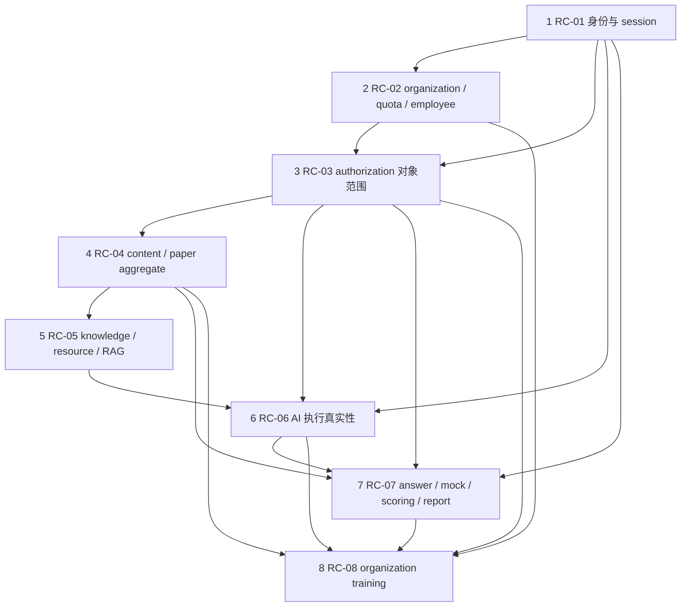

# P0 整改启动包 v1.0

日期：2026-07-14

范围：只读复验、规划和治理文档物化；未修改业务代码，未执行运行时验收。

机器可核验总表：`2026-07-14-p0-remediation-finding-ledger-v1.yaml`

## 1. 结论先行

- `D:\tiku` 当前 `master`、本地 `origin/master` 和实时远端 `master` 均为 `7aac83765ca4b650b73b1612013e26a0111775ae`，与静态审计源基线完全相同，ahead/behind 为 `0/0`。
- `D:\tiku-readonly-audit` 当前 `feat/calibration` 为 `a84224fa12ec85b28e6acd945deba2afa28c6c02`，tree 为 `668acf31e8579410b9969c1370f2405485b8fdd4`，工作区干净，`git fsck --full --no-dangling` 通过。
- 源代码相对审计基线的变更文件集合为空，因此不存在需定向重基线的 P0。35 个 P0 原始状态均为 `validated`；本次整改复验分类为 `confirmed=30`、`root_cause_alias=5`，其余分类均为 0。
- 35 个 P0 被划分为 8 个内聚根因簇。共享根因不减少 finding 数量，不把任何 finding 标记为 duplicate、resolved 或降级。
- 推荐首个 WIP 为 `RC-01 身份、session 与后台账号生命周期`。本启动包不激活、不实现该根因簇。

## 2. 当前基线恢复记录

### 2.1 源仓库

| 项目           | 当前事实                                                                                  |
| -------------- | ----------------------------------------------------------------------------------------- |
| 仓库           | `D:\tiku`                                                                                 |
| 分支 / HEAD    | `master` / `7aac83765ca4b650b73b1612013e26a0111775ae`                                     |
| tree           | `a1961f75ce6fdec455be0b028e314eb39c122d33`                                                |
| status         | clean                                                                                     |
| 本地 tracking  | `origin/master = 7aac83765ca4b650b73b1612013e26a0111775ae`                                |
| 实时远端       | `refs/heads/master = 7aac83765ca4b650b73b1612013e26a0111775ae`                            |
| ahead / behind | `0 / 0`                                                                                   |
| worktree       | 根 worktree `D:\tiku`；本任务隔离 worktree `D:\tiku\.worktrees\p0-remediation-startup-v1` |
| 本任务分支     | `codex/p0-remediation-startup-v1`，基于相同 HEAD                                          |

审计源基线也是 `7aac83765ca4b650b73b1612013e26a0111775ae`，故：

- `git diff 7aac837...HEAD --name-only` 为空；
- “代码变更文件 → 受影响 P0 finding”映射为空；
- 35 个 P0 沿用同一代码事实进行复验，不进行无依据的全量推翻。

### 2.2 只读审计仓库

| 项目        | 当前事实                                                        |
| ----------- | --------------------------------------------------------------- |
| 仓库        | `D:\tiku-readonly-audit`                                        |
| 分支 / HEAD | `feat/calibration` / `a84224fa12ec85b28e6acd945deba2afa28c6c02` |
| tree        | `668acf31e8579410b9969c1370f2405485b8fdd4`                      |
| status      | clean                                                           |
| remote      | 未配置                                                          |
| 对象完整性  | `git fsck --full --no-dangling` 退出码 0                        |

关键材料 SHA-256：

| 文件                   | SHA-256                                                            |
| ---------------------- | ------------------------------------------------------------------ |
| final synthesis        | `C3E3BEFBBD0BA55FB11B75ACD324AF566CBD343A1470495BA6F399328E0307E2` |
| global reconciliation  | `748541195D4C6C6725DD8BFC803C9F029FF1D1F911B009E37A6CCBDA3338D16E` |
| finding register       | `CDB8CE059566ABEDDA3D4C723E3F048ECFA677697053FB7765D6EF46273752F2` |
| runtime backlog        | `61AC94E58CBF10F7C0A8C729096C2158AAF7567DD4982B1A957B0F57042FBCAA` |
| runtime sequencing     | `7988442B3928580A6A84E5189BF192F62457F7375792BA105644A0AF07C1C6F0` |
| final completion audit | `1A0AFA955676E95CF98E71C5FCB40C4B2CD410EEB4664A00515B29DB00D27AAA` |

### 2.3 项目状态与队列冲突检查

- `project-state.yaml.currentTask` 是已关闭的 `content-admin-platform-f5-final-cumulative-audit-2026-07-13`。
- `task-queue.yaml.activeTasks` 仅保留同一已关闭 F5 终态，没有 active pending 产品任务。
- 条件任务保持条件未触发；另有需要外部条件/批准的私有凭据目录维护，不与本 docs-only 启动包冲突。
- `repositoryCheckpoint.lastKnownMasterSha` 仍为 `20e396...`，落后于实际 `7aac837...`。这是已关闭治理元数据的陈旧记录，不是源代码漂移；现有 recovery smoke 对 state/queue 顶层结构和终态有严格约束，本任务不篡改它们。
- 用户本轮指令是独立的 docs-only 授权。恢复入口采用只读 state/queue 加本计划、主包、ledger、evidence 四文件，不伪造或重开已关闭产品任务。

## 3. 35 个 P0 规范化登记

完整字段位于 YAML ledger。每个 finding 均含：ID、标题/实质、原证据、角色/用例/失败链、横向能力、状态机、跨角色依赖、代码锚点、业务不变量、风险、复验状态、根因簇、P0 关系、P1/P2 影响候选、测试与 runtime 入口。

### 3.1 完整性索引

| 根因簇 | P0 finding（全部且仅出现一次）                 | 数量 |
| ------ | ---------------------------------------------- | ---: |
| RC-01  | F-0002、F-0045、F-0130                         |    3 |
| RC-02  | F-0005、F-0006、F-0109、F-0111、F-0113         |    5 |
| RC-03  | F-0011、F-0014、F-0016                         |    3 |
| RC-04  | F-0050、F-0051、F-0092、F-0093、F-0171         |    5 |
| RC-05  | F-0068、F-0075、F-0076、F-0080、F-0081、F-0084 |    6 |
| RC-06  | F-0062、F-0101、F-0102、F-0134                 |    4 |
| RC-07  | F-0059、F-0060、F-0061、F-0064、F-0066、F-0136 |    6 |
| RC-08  | F-0121、F-0123、F-0145                         |    3 |
| 合计   | 35 个唯一 ID                                   |   35 |

### 3.2 复验状态语义与统计

| 状态                        | 数量 | 含义                                                                               |
| --------------------------- | ---: | ---------------------------------------------------------------------------------- |
| `confirmed`                 |   30 | 当前代码与审计基线相同，静态证据和反证搜索继续成立                                 |
| `root_cause_alias`          |    5 | 与另一 finding 共享修复原语，但失败路径、数据域或验收义务独立；仍是 confirmed 风险 |
| `baseline_changed`          |    0 | 无相关源代码变化                                                                   |
| `duplicate_candidate`       |    0 | 未发现足以提出重复候选的证据                                                       |
| `false_positive_candidate`  |    0 | 未发现足以提出误报候选的证据                                                       |
| `runtime_evidence_required` |    0 | 35 个 P0 均有充分静态证据；全局此状态仍仅属于 P1 F-0013                            |

五个 alias 是：

- F-0130 → F-0002：共享持久、原子登录失败状态机，但学员与后台账号域阈值/会话语义不同。
- F-0113 → F-0005：共享统一员工生命周期命令，但导入路径还含目标 organization、session 和训练归属风险。
- F-0016 → F-0011：共享所选 `org_auth` 对象级范围校验，但生产训练和消费训练是两条独立越权链。
- F-0134 → F-0062：共享“本地伪结果被当成生产真值”的执行边界，但个人练习与正式 mock 评分域独立。
- F-0123 → F-0121：共享缺失 canonical organization training draft/version 聚合，但发布幂等/锁与输入信任分别成立。

## 4. 根因簇

### RC-01 身份、session 与后台账号生命周期

- 覆盖：F-0002、F-0045、F-0130。
- 根因假设：身份主体、失败锁定、角色绑定、停用/重置和 session 撤销没有统一的持久化权威状态与原子命令；UI 或进程内状态承担了安全不变量。
- 反证：服务层已有锁定算法，学员表已有失败字段，部分页面已有失败状态；这些证明局部算法存在，不证明默认多实例运行时和后台账号生命周期闭环。
- 上游：账号域、管理员角色模型、数据库事务和 session repository。
- 下游：所有后台工作区、organization 管理、授权、内容、AI、审计归因。
- 爆炸半径：五类后台管理员及所有学员登录；错误修复可造成全员锁死、旧 session 未撤销或角色提升。
- 数据兼容：新增持久状态必须为历史账号设置安全默认值；角色多值迁移不能丢失现有角色；时间必须按服务端统一时钟。
- 安全风险：暴力破解绕过、已停用主体继续访问、管理员角色不可治理。
- 最小可验证修复边界：持久且原子的失败计数/锁定；后台账号 CRUD/多角色/停用；停用/重置 session 撤销；默认 runtime repository 测试。
- 批准：需要新一轮业务源码/测试授权；如新增字段或迁移，需单独 schema/migration 人工批准；runtime/数据库验证另行批准。

### RC-02 organization 拓扑、授权范围、额度与员工生命周期

- 覆盖：F-0005、F-0006、F-0109、F-0111、F-0113。
- 根因假设：organization 树、`org_auth` 原子覆盖范围、额度占用和 employee 绑定被拆成可绕过的局部 CRUD/快照，而非同一事务内的领域命令。
- 反证：现有 repository 已有部分 overlap、深度、循环和额度检查；它们不覆盖错误的 `auth_scope_type` 语义、树移动后的动态范围、旧导入路径和统一 session/training 后置动作。
- 上游：RC-01 的可靠主体/session；organization 树与 ADR-007。
- 下游：RC-03、organization workspace、training、analytics、组织 AI。
- 爆炸半径：所有企业授权、员工绑定和后代节点；错误修复可重复占额、跨 organization 泄漏或使历史范围漂移。
- 数据兼容：现有静态 scope snapshot、重叠 auth、员工绑定和历史训练 snapshot 需要审计/迁移策略，不能静默重解释。
- 安全风险：跨 organization 写入、越权授权、额度绕过、运营低权限移动组织节点。
- 最小可验证修复边界：统一 employee create/import/transfer/unbind command；原子 quota；动态、可证明的组织覆盖；限制 node move；保留历史 snapshot。
- 批准：高风险业务修复；需要源码/测试和很可能的 schema/data migration 单独批准，数据库回填/抽样另批。

### RC-03 显式 authorization 上下文与对象级范围校验

- 覆盖：F-0011、F-0014、F-0016。
- 根因假设：消费者把“存在任一 advanced authorization/capability”误当成“所选 authorization 覆盖本次 profession、level、organization 和对象”，并信任客户端或会话摘要的 scope 结论。
- 反证：effective authorization context 已携带 profession/level，部分路由也验证 owner；缺陷在消费适配器没有把请求对象与唯一授权上下文联结，不需要推翻 ADR-007。
- 上游：RC-01、RC-02。
- 下游：AI generation、organization training、quota/RAG/题源选择。
- 爆炸半径：个人/企业高级能力全部对象级访问；错误修复可能静默切换授权、错扣 quota 或扩大范围。
- 数据兼容：已持久 AI task/training 记录的 authorization attribution 可能与实际范围不一致，只可标记/审计，不能无证据重写历史。
- 安全风险：跨 profession、level、organization 越权和付费范围绕过。
- 最小可验证修复边界：服务端按请求 scope 显式选择/验证唯一 authorization；owner、edition、capability、有效期、scope 全部通过后才能执行；取消/到期并发 fail-closed。
- 批准：需要源码/测试授权；若不改 schema 可免迁移，但历史数据诊断和 runtime 验证仍需批准。

### RC-04 内容与 paper 聚合、事务、发布快照完整性

- 覆盖：F-0050、F-0051、F-0092、F-0093、F-0171。
- 根因假设：question/material/paper 的跨字段语义、group identity、评分点和发布 snapshot 没有由单一 aggregate/transaction 强制，读写 DTO 的字段血缘不一致。
- 反证：相关表、部分 validator、草稿 DTO 和 `paper_scoring_point` 已存在；这证明数据结构局部存在，不证明写入原子、题型矩阵和学员 snapshot 完整。
- 上游：内容需求、2026-07-13 P0 data-integrity contract。
- 下游：RC-05 题目知识关系、RC-07 正式答题/评分、RC-08 平台 paper snapshot 导入。
- 爆炸半径：全部正式题、材料、试卷和历史报告；错误修复可破坏已发布不可变性或导致评分规则永久丢失。
- 数据兼容：历史富文本、非法题型组合、缺评分点 snapshot、group identity 冲突需显式兼容/拒绝策略；不可伪造历史。
- 安全风险：主要是数据完整性；富文本还需保持既有 sanitization/XSS 边界。
- 最小可验证修复边界：共享语义 validator；事务性 aggregate command；稳定 group/material identity；published snapshot 一等复制评分点并校验合计。
- 批准：源码/测试授权；若需修复 schema 或历史快照，需单独 migration/数据策略批准。

### RC-05 knowledge_node、resource、RAG 与 citation 事实链

- 覆盖：F-0068、F-0075、F-0076、F-0080、F-0081、F-0084。
- 根因假设：knowledge/resource 关系、index generation、推荐确认和 citation 没有持久化事实链，状态标签/UI 本地状态被误当成真实向量/关键词索引与证据。
- 反证：knowledge/resource/chunk 相关 schema 和部分过滤器存在；它们不证明 index 真实构建、原子切换、关系完整或 citation 可追溯。
- 上游：RC-04 的正式内容/知识绑定。
- 下游：RC-06 AI 执行、RC-07 评分/讲解、RC-08 组织 AI/训练证据门禁。
- 爆炸半径：所有 RAG、knowledge recommendation、AI citation 和 `evidence_status`。
- 数据兼容：现有 `rag_ready` 可能是假阳性；不能仅批量改状态，需以可验证 index generation/chunk 事实重建。
- 安全风险：越权资源检索、伪引用、跨专业/等级/organization 泄漏。
- 最小可验证修复边界：一致的 knowledge_node 不变量；受控 relation；版本化 chunk/index generation；原子切换；禁用/启用核验；推荐和 citation 持久化。
- 批准：源码/测试必批；外部向量/Provider、依赖、基础设施、schema/migration 和数据重建分别需要 fresh approval。

### RC-06 model_config、AI 任务执行与结果真实性

- 覆盖：F-0062、F-0101、F-0102、F-0134。
- 根因假设：生产 AI 执行没有可治理、可挂载、可保密的 model/prompt 配置和明确执行器边界，本地确定性 fixture/长度算法被包装成成功业务结果。
- 反证：AI task schema、局部配置组件和测试桩存在；它们只能证明接口形状，不能证明 production executor、secret custody 或真实评分/生成。
- 上游：RC-01/03 安全上下文、RC-05 证据链。
- 下游：RC-07 评分/报告、RC-08 organization AI/training。
- 爆炸半径：AI scoring、personal AI practice、model/prompt governance、quota/日志归因。
- 数据兼容：历史伪结果不能伪装成真实 Provider 结果；需标记 provenance/version，不能静默重算成绩。
- 安全风险：API key 泄漏、错误模型/Prompt 口径、伪成绩和成本归因错误。
- 最小可验证修复边界：挂载受权治理 UI/API；secret 引用而非明文/last4 充当真值；版本化 executor；production 路径拒绝 fixture；任务/结果 provenance。
- 批准：源码/测试必批；secret/env、Provider、Cost Calibration、外部服务、依赖和 runtime 调用均需各自 fresh approval。

### RC-07 answer_record、mock_exam、ai_scoring 与 exam_report 状态闭环

- 覆盖：F-0059、F-0060、F-0061、F-0064、F-0066、F-0136。
- 根因假设：客户端时间/内存状态和分散 repository 被当作答题权威，缺少服务端版本、幂等提交、原子状态转换和同一 attempt/report 身份血缘。
- 反证：现有 route/service 和纯函数测试覆盖部分 happy path；它们没有证明刷新、多设备、超时、失败恢复、报告重载和用户隔离。
- 上游：RC-01/03/04/06。
- 下游：RC-08 organization training answer/analytics，以及所有学员历史/建议。
- 爆炸半径：四类学员的 practice/mock、评分、报告、错题/建议；错误修复可能重复提交、覆盖新答案或泄露答案。
- 数据兼容：历史 answer/scoring/report 缺字段只能显式标记 incomplete；不能用 fallback 伪造评分或 report identity。
- 安全风险：跨用户缓存泄漏、提前泄露标准答案、重复/过期写覆盖。
- 最小可验证修复边界：服务端 deadline/version；幂等 answer/submit；乐观锁/事务；评分结果完整落库；稳定 report public id；按 question_group 导航。
- 批准：源码/测试授权；可能的 schema/migration 另批；浏览器、多设备、断网和数据库 runtime 验证另批。

### RC-08 organization training 草稿、发布、作答与统计完整性

- 覆盖：F-0121、F-0123、F-0145。
- 根因假设：缺少 canonical server-owned draft/version/answer aggregate，publish 信任客户端快照且无消费锁，submit 信任客户端 score/count。
- 反证：四步 wizard、部分 validator、version/answer 表存在；这些不证明发布源可追溯、一次消费、immutable version 或服务端评分。
- 上游：RC-02/03/04/06/07。
- 下游：employee training、organization analytics、AI result-to-training handoff。
- 爆炸半径：所有 organization training 内容、员工成绩和组织统计；错误修复可跨组织发布、重复版本或篡改成绩。
- 数据兼容：历史版本/答案可能缺 canonical draft provenance；保留历史并标记，不反向写正式 paper/mock/report。
- 安全风险：跨 organization 来源、客户端篡改分数、重放发布/提交。
- 最小可验证修复边界：持久 draft；publish 事务锁与 idempotency key；不可变 version；服务端根据 snapshot 评分并一次提交；analytics 只读服务端事实。
- 批准：源码/测试必批；schema/migration/数据诊断和 runtime 验收分别 fresh approval。

## 5. 根因簇依赖图与整改顺序

拓扑顺序按 WIP=1 串行执行为：`RC-01 → RC-02 → RC-03 → RC-04 → RC-05 → RC-06 → RC-07 → RC-08`。

RC-04 与 RC-02/03 在部分代码上可独立，但本阶段不并行：先固定主体、租户和 authorization 边界，再动不可逆内容快照，可减少测试身份和数据隔离基线反复变化。图无循环。

## 6. P1/P2 影响映射

这只是“P0 修复后需要如何复验”的路由，不改变 143 个 P1/P2 的原始状态，不声明已覆盖或已解决。四分类合计：`potentially_covered=102`、`semantic_change=36`、`revalidate_after_p0=3`、`unrelated_deferred=2`，总计 143，全部且仅一次。

### P1/P2 impact RC-01

- potentially covered：F-0001、F-0030、F-0046、F-0048、F-0049、F-0129、F-0131
- semantic change：F-0041、F-0047、F-0106

### P1/P2 impact RC-02

- potentially covered：F-0004、F-0007、F-0008、F-0009、F-0012、F-0015、F-0107、F-0110、F-0112、F-0114、F-0115、F-0116、F-0117、F-0119、F-0140
- semantic change：F-0010、F-0017、F-0118、F-0120

### P1/P2 impact RC-03

- potentially covered：F-0025、F-0036、F-0143、F-0146、F-0148、F-0149
- semantic change：F-0151、F-0153、F-0154、F-0157、F-0158、F-0170

### P1/P2 impact RC-04

- potentially covered：F-0024、F-0052、F-0053、F-0055、F-0056、F-0058、F-0074、F-0094、F-0095、F-0096、F-0098、F-0100、F-0155
- semantic change：F-0057、F-0073

### P1/P2 impact RC-05

- potentially covered：F-0031、F-0032、F-0037、F-0040、F-0054、F-0069、F-0070、F-0071、F-0077、F-0078、F-0082、F-0083、F-0085、F-0086、F-0087、F-0088、F-0089、F-0090
- semantic change：F-0029、F-0035、F-0072、F-0097

### P1/P2 impact RC-06

- potentially covered：F-0021、F-0038、F-0039、F-0063、F-0091、F-0105、F-0150、F-0156、F-0160、F-0174、F-0177、F-0178
- semantic change：F-0103、F-0104

### P1/P2 impact RC-07

- potentially covered：F-0013、F-0018、F-0020、F-0026、F-0027、F-0034、F-0065、F-0067、F-0079、F-0135、F-0137、F-0142、F-0152、F-0162、F-0164、F-0169、F-0172、F-0175、F-0176
- semantic change：F-0003、F-0019、F-0108、F-0132、F-0133、F-0138、F-0141、F-0161、F-0163、F-0165、F-0168、F-0173
- revalidate after P0：F-0023、F-0139、F-0159

### P1/P2 impact RC-08

- potentially covered：F-0022、F-0028、F-0033、F-0099、F-0122、F-0124、F-0125、F-0126、F-0144、F-0147、F-0166、F-0167
- semantic change：F-0042、F-0127、F-0128

### 与 P0 无关、暂不触碰

- unrelated deferred：F-0043、F-0044（accessibility 独立根因；即使 UI 文件重叠，也不因 P0 修复自动关闭）。

## 7. 验收契约

### 7.1 每个根因簇强制共同矩阵

以下维度对 RC-01 至 RC-08 每一簇都必须逐项产出 RED/GREEN 证据，不得用 happy path 代替：

1. 正常路径：唯一权威写入成功，读模型可重载，历史与新状态一致。
2. 越权/跨 organization：无权限角色、错误 owner、错误 profession/level、父/子/兄弟/全局范围均 fail-closed。
3. 非法状态转换：跳步、终态回退、已取消/过期/停用对象写入被拒绝。
4. 重复与并发：同 idempotency key、不同 key、并发写、乱序响应、多实例竞争均不重复消费或覆盖新值。
5. 事务中途失败：每个外部/持久化边界注入失败；要么全回滚，要么进入可恢复明确状态。
6. 重试/回滚/幂等：可重试错误不重复副作用，不可重试错误清晰；回滚保留审计归因。
7. null/空集合/边界/异常：`null`、`[]`、零/上限/越界、空富文本、缺 scope、过期时间和未知枚举。
8. 前后端字段/枚举：JSON camelCase、DB snake_case、术语表枚举一致，未知值不静默 fallback。
9. API：`{ code, message, data, pagination? }`；可选字段返回 `null`，空列表 `[]`；外部 URL 只用 public id。
10. 回归与测试：相关角色全覆盖；单元、repository/service 集成、API 契约和端到端分层；runtime 仅在 fresh approval 后执行。

### 7.2 RC-01 专属契约

- 正常：学员 3 次/5 分钟、管理员 5 次/15 分钟分别持久原子计数；成功登录清零；后台账号创建、多角色、停用/启用/重置可治理。
- 对抗：跨实例分散失败仍锁定；并发最后一次失败只形成一个锁定；停用/重置立即撤销目标 session，不能撤销其他主体；低角色不能管理高角色。
- 故障/边界：时钟临界、数据库失败、重复停用、空角色、最后一个 super admin 保护；历史账号默认未锁定。
- 回归角色：student/employee、super_admin、ops_admin、content_admin、org_standard_admin、org_advanced_admin。
- 测试：auth 纯函数单元、默认 repository 集成、session API 契约、多实例/重启 E2E。
- runtime：RV-0006、RV-0010、RV-0016、RV-0019、RV-0021。

### 7.3 RC-02 专属契约

- 正常：tree 变更、scope 展开、quota 占用/释放、employee create/import/transfer/unbind 在一个领域事务闭环。
- 对抗：兄弟/父子 organization 越权、`auth_scope_type` 错配、并发占满最后额度、旧 import 绕过、ops_admin node move 均拒绝。
- 故障/边界：中途创建用户后额度失败必须回滚；重复导入/transfer 幂等；最大深度、循环、空后代、停用节点、历史 snapshot。
- 回归角色：super_admin、ops_admin、两类 org admin、两类 employee。
- 测试：tree/scope 单元、quota transaction 集成、employee API 契约、并发 DB/E2E。
- runtime：RV-0018、RV-0019、RV-0020、RV-0021。

### 7.4 RC-03 专属契约

- 正常：请求明确携带/解析唯一 authorization public id，profession/level/organization/edition/capability 全匹配才执行和扣 quota。
- 对抗：跨 profession、跨 level、错误 organization、多授权歧义、取消/到期竞态、客户端 `isScopeAllowed=true` 一律不能越权。
- 故障/边界：authorization 消失或在提交时失效；重复请求只扣一次；空 context/空可用授权/未知 edition 返回稳定错误。
- 回归角色：personal advanced、org advanced admin/employee，并验证所有 standard 角色拒绝。
- 测试：scope selector 单元、authorization repository 集成、AI/training API 契约、授权撤销竞态 E2E。
- runtime：RV-0020；F-0014 原审计未要求 runtime，仍需静态/集成契约覆盖。

### 7.5 RC-04 专属契约

- 正常：富文本 round-trip；题型/评分方式联合校验；paper aggregate 一次提交；group/material identity 稳定；评分点进入不可变 published snapshot。
- 对抗：绕过 UI 的非法 payload、重复 publish、并发改草稿、缺 scoring point、跨 paper group 引用、富文本脚本注入。
- 故障/边界：任一子写失败全回滚；乐观锁冲突不静默覆盖；空 rich text、空 section、0.5 分粒度、合计不等、旧 snapshot。
- 回归角色：content_admin 与四类学员。
- 测试：type matrix 单元、paper transaction/repository 集成、content API 契约、发布后学员 snapshot E2E。
- runtime：RV-0011、RV-0012、RV-0015、RV-0021。

### 7.6 RC-05 专属契约

- 正常：knowledge tree 不变量；resource 关系受控；versioned chunks/index 原子切换；推荐确认可重载；citation 指向可验证 chunk。
- 对抗：跨 profession/level/organization 检索、禁用资源、假 `rag_ready`、无 citation 却 sufficient、关系自由字符串注入。
- 故障/边界：重建失败继续旧 index；首次失败保持不可检索；重复 rebuild 幂等/串行；空树/空命中返回 `[]`/`none`。
- 回归角色：content_admin、super_admin、四类学员/员工、organization AI/training。
- 测试：tree/relation 单元、index generation repository 集成、RAG API 契约、经批准的真实索引 E2E。
- runtime：RV-0013、RV-0014。

### 7.7 RC-06 专属契约

- 正常：受权 model_config/prompt_template 版本被任务锁定；secret 通过引用解析；真实 executor 产出带 provenance 的结果。
- 对抗：非 super_admin 配置、跨 organization 任务、伪 fixture 进入 production、last4 反推/回显 secret、未知 provider/model。
- 故障/边界：Provider 超时/限流/失败；重试不重复扣 quota/写结果；任务取消与晚到响应；null prompt version、空 scoring point。
- 回归角色：super_admin、content/admin AI、个人/企业高级角色，并验证标准角色拒绝。
- 测试：executor/mapper 单元、task+quota transaction 集成、model/prompt API 契约、Provider runtime 仅经批准。
- runtime：RV-0012、RV-0017、RV-0021。

### 7.8 RC-07 专属契约

- 正常：服务端 timer/version；autosave 可重载；submit 幂等；ai_scoring 完整落库；稳定 report public id；skill group 导航。
- 对抗：跨用户缓存、提前读取答案、离线旧写覆盖新写、并发 submit、超时后提交、mock id 冒充 report id。
- 故障/边界：autosave/score/report 任一步失败可恢复；重试不重复评分；null answer、空 group、最后一秒、历史 incomplete report。
- 回归角色：personal standard/advanced、org standard/advanced employee；相关 content snapshot 只读回归。
- 测试：state reducer 单元、answer/scoring/report repository 集成、API 契约、断网/多设备/刷新 E2E。
- runtime：RV-0012、RV-0015、RV-0021。

### 7.9 RC-08 专属契约

- 正常：canonical draft → validation → immutable version → one employee one submit → server score → analytics。
- 对抗：跨 organization source/destination、客户端伪 score/count、重复 publish、并发 publish、重复 employee submit、takedown 后提交。
- 故障/边界：publish 子步骤失败全回滚；idempotency key 重放返回同一 version；weak/none evidence 门禁；null deadline、空题、范围无员工。
- 回归角色：org_advanced_admin/employee；standard admin/employee 拒绝；ops/content/personal 不能越界；AI result handoff 保持域隔离。
- 测试：draft/version/answer 单元、publish/submit transaction 集成、API 契约、经批准的 organization E2E。
- runtime：RV-0020。

## 8. WIP=1 执行队列

唯一首项：`RC-01 身份、session 与后台账号生命周期`。

选择理由：

1. 所有后续 organization、authorization、内容和 AI 审计归因都依赖可信主体和可撤销 session。
2. 它直接包含暴力破解绕过和高权限账号生命周期缺失，安全优先级最高。
3. 它为 RC-02/03 的越权测试提供稳定账号/角色/session fixture，减少后续重复返工。

前置依赖：需求语义已明确；实现前仍需 fresh approval 和独立 task plan。若设计新增字段，先通过 schema/migration 审批门禁。

纳入：

- F-0002、F-0045、F-0130；
- 持久/原子失败计数与锁定；
- 后台账号创建、角色绑定、多角色、停用/启用、重置；
- session 撤销及服务端权限；
- 相应 unit/integration/contract 测试。

排除：

- organization tree、employee、quota、`org_auth`；
- 内容、paper、RAG、AI executor；
- 浏览器/数据库/Provider runtime acceptance；
- 依赖、外部配置、部署、PR、push；
- P1/P2 实现。

预计代码模块：

- `src/db/schema/auth.ts`
- `src/server/auth/local-session-runtime.ts`
- session service/repository/validator 与 `/api/v1/sessions`
- admin account service/repository/validator、workspace role guard 与后台账号 API/UI
- 对应测试文件

实现前必读：

- `AGENTS.md`、品味十诫、UI code、ADR-001 至 ADR-007；
- `modules/01-user-auth.md`、`modules/06-admin-ops.md` 及对应 stories；
- role-separated/role-experience traceability；
- 2026-07-13 platform interaction contract；
- dependency introduction gate、schema/migration/数据安全相关 SOP；
- 本启动包、ledger、evidence。

需要批准：

- 当前启动包完成不需要新增批准。
- 开始 RC-01 业务源码/测试修改需要用户 fresh approval。
- 任何 schema/migration、数据库读取/写入、浏览器/runtime 验收均需分别明确批准。
- 当前未发现必须新增依赖；若设计提出依赖，必须先走 dependency introduction gate，不能顺手修改 package/lockfile。

## 9. 非声明

- 未声明任何 P0 已修复。
- 未声明 P1/P2 已复验、已覆盖或已解决。
- 未声明业务验收、runtime acceptance、release readiness 或 production usability。
- 未执行 21 项 runtime validation。
- 未修改 `D:\tiku-readonly-audit`，未修改 `D:\tiku` 业务源码、测试、依赖、schema、migration 或外部配置。
