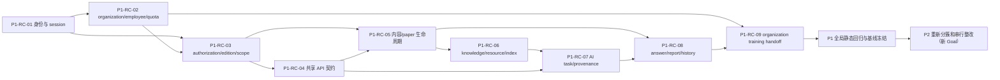

# P1/P2 整改启动包 v1.0

Audit result: APPROVE

Verdict: APPROVE 当前 governance-only 启动包；不批准 P1/P2 业务实现或 runtime validation。

## 1. 结论与边界

本启动包只建立 P1/P2 整改的当前静态恢复面和执行设计，不进入 P1 或 P2 业务实现。原审计中的 125 个 P1、18 个 P2 共 143 个 finding 已在一级复检台账中全部且仅登记一次；每项均保留原 finding 身份、风险等级、证据、角色、用例、横向能力和 runtime 入口。

一级复检只回答“当前锚点和 P0 影响发生了什么”，不替代根因簇领取时的二级对抗式复检。`potentiallyCovered` 不是已修复，`baseline_changed` 不是问题不存在，`root_cause_alias` 也不能自动关闭原 finding。

本 Goal 明确排除：

- P1/P2 业务源码和产品测试修改；
- schema/migration、依赖、lockfile、数据库、Provider、secret/env、浏览器和 runtime validation；
- PR、force push、部署；
- 第一个 P1 根因簇的领取或实现；
- 修改 `D:/tiku-readonly-audit` 或原始 finding 状态。

## 2. 当前基线恢复

| 项目                                     | 当前恢复结果                                                    |
| ---------------------------------------- | --------------------------------------------------------------- |
| 源仓库主分支                             | `master`                                                        |
| `master` / `origin/master` / live remote | `0643ad4d6346453f3324d86b6e003c6726c808ef`                      |
| P0 产品业务静态基线                      | `e136ca28acde82282a17c65ccfb828a01e872c0b`                      |
| 原始审计源代码基线                       | `7aac83765ca4b650b73b1612013e26a0111775ae`                      |
| `e136ca28..0643ad4d` 产品路径漂移        | `src/tests/drizzle/e2e/package/lockfile = 0`                    |
| P0 Program                               | `closed`，8 个根因簇和全局静态回归均关闭                        |
| 审计仓分支 / HEAD                        | `feat/calibration` / `a84224fa12ec85b28e6acd945deba2afa28c6c02` |
| 审计仓状态                               | clean；`git fsck --full --no-dangling` 通过；冻结材料哈希一致   |
| runtime backlog                          | 21 项仍为 `pending` 且需要批准                                  |

当前启动包工作区隔离为 `D:/tiku/.worktrees/p1-p2-remediation-startup-package-v1`，分支为 `codex/p1-p2-remediation-startup-package-v1`。根工作区继续停留在 `master`。

## 3. 一级复检方法

对每个 P1/P2 finding 执行以下静态核对：

1. 从只读 `finding-register.yaml` 恢复原 ID、风险、标题、状态、角色、用例、横向能力、需求证据、代码证据、反证搜索和 runtime ID。
2. 从 P0 冻结影响图恢复唯一 P0 根因簇和影响类别。
3. 检查原 requirement/code/test 文件锚点在当前工作树是否仍存在。
4. 将原代码和测试锚点与 `7aac837..e136ca2` 产品变更文件逐项相交，区分直接变化、移动/缺失和无直接 diff。
5. 分开记录证据状态、处置结论和执行状态，禁止三个维度相互推导。
6. 只给出候选根因簇；权威调用链、RED 反例和最终归并留到该簇被领取时即时完成。

三个状态维度为：

- `evidenceStatus`：`confirmed`、`baseline_changed`、`root_cause_alias`、`duplicate_candidate`、`false_positive_candidate`、`runtime_evidence_required`；
- `disposition`：`remediation_required`、`statically_closed_by_p0`、`partially_covered_by_p0`、`requirement_superseded`、`runtime_hold`、`pending_deep_revalidation`；
- `executionStatus`：`pending`、`in_progress`、`ready_for_closeout`、`closed`。

本轮没有把任何 finding 标为 `statically_closed_by_p0`、`requirement_superseded`、`duplicate_candidate`、`false_positive_candidate` 或 `closed`，因为一级复检不足以支持这些结论。

## 4. 143 项复检统计

| 维度 | 分类                        | 数量 |
| ---- | --------------------------- | ---: |
| 风险 | P1                          |  125 |
| 风险 | P2                          |   18 |
| 证据 | `baseline_changed`          |  140 |
| 证据 | `confirmed`                 |    2 |
| 证据 | `runtime_evidence_required` |    1 |
| 处置 | `pending_deep_revalidation` |  107 |
| 处置 | `partially_covered_by_p0`   |   35 |
| 处置 | `runtime_hold`              |    1 |
| 执行 | `pending`                   |  143 |

140 个 `baseline_changed` 的含义是原证据锚点受到 P0 直接修改、语义变化、要求 P0 后复验或锚点移动影响；不是 140 项均已修复。F-0013 单独保持 `runtime_evidence_required + runtime_hold + pending`，其 runtime ID 继续保留，不能通过静态证据关闭。

P0 影响类别保持冻结数量：

| 类别                 | 数量 |
| -------------------- | ---: |
| `potentiallyCovered` |   96 |
| `semanticChange`     |   35 |
| `revalidateAfterP0`  |   10 |
| `unrelatedDeferred`  |    2 |

## 5. 候选根因簇

候选簇按业务不变量和权威写路径建立，不把同一角色、目录或页面视为共因。一级复检分布如下；大簇必须在二级复检时继续拆成约 5～12 个 finding 的可审查任务，不能为了减少任务数量强行合并。

| 候选簇   | finding 数 | 主题                                   |
| -------- | ---------: | -------------------------------------- |
| P1-RC-01 |          4 | identity/session/account boundary      |
| P1-RC-02 |          7 | organization/employee/quota lifecycle  |
| P1-RC-03 |          9 | authorization/edition/scope read model |
| P1-RC-04 |         30 | shared API query/mutation contract     |
| P1-RC-05 |         15 | content editor/paper lifecycle         |
| P1-RC-06 |         10 | knowledge/resource/index lifecycle     |
| P1-RC-07 |         18 | AI task/generation provenance          |
| P1-RC-08 |         22 | learner answer/report/history          |
| P1-RC-09 |         10 | organization training handoff          |
| P2-RC-01 |          4 | query/navigation/async                 |
| P2-RC-02 |          3 | edit dirty/data loss                   |
| P2-RC-03 |          8 | contract/error/recovery                |
| P2-RC-04 |          3 | accessibility                          |

每个簇的根因假设、反证、依赖、爆炸半径、兼容性、安全风险、最小边界、审批边界和验收契约详见根因簇 YAML。成员关系只是一级候选；二级复检可以有证据地拆分或重归并，但不得删除、降级或重复登记 finding。

## 6. 依赖图和候选顺序

推荐 P1 首个候选簇是 P1-RC-01，因为身份唯一性和服务端 session 是 authorization、organization 和九角色入口的共同上游，并包含账号接管/拒绝服务类风险。它不是已领取任务：未来 P1 Program 获批后，必须先对该簇执行二级对抗复检；若 F-0001、F-0003 等已被 P0 完整静态关闭，则以证据关闭并选择下一个仍 confirmed 的安全/越权/不可逆数据问题。

## 7. WIP=1 和分阶段队列

- 当前唯一 WIP 是“P1/P2 整改启动包 v1.0”；P1/P2 实现 WIP 为 0。
- P1 Program 尚未创建和授权；串行方案仅为 draft。
- P1 执行时每次只允许一个二级复检后的最小根因任务；每任务独立 plan、worktree、测试、两轮复核、evidence、提交、fresh-master 门禁、授权 push 和清理。
- P1 冻结前，P2 只能更新影响映射，不能存在可领取实现任务。
- P1 全局静态回归和新基线冻结后，必须建立独立 P2 Goal，从新基线重新复检 18 个 P2。
- 21 项 runtime validation 必须建立再下一个独立 Goal。

## 8. 审批矩阵

| 能力                                       | 当前启动包                   | 未来 P1/P2 Program 建议                     |
| ------------------------------------------ | ---------------------------- | ------------------------------------------- |
| governance docs/state/queue/static scripts | 本 Goal 内允许               | 每任务 allowlist                            |
| 业务源码与产品测试                         | 禁止                         | 需新 Program 明确授权                       |
| schema/migration 源码                      | 禁止                         | 可考虑 Program 级源码授权；不得继承 P0 授权 |
| 数据库 apply/backfill/seed                 | 禁止                         | 每项 fresh approval                         |
| 依赖/package/lockfile                      | 禁止                         | 依赖门禁 + fresh approval + 独立提交        |
| Provider/secret/env/真实 AI 调用           | 禁止                         | 每项 fresh approval                         |
| 浏览器/runtime validation                  | 禁止                         | 按 runtime ID 和 sequencing 单独批准        |
| local commit                               | 启动包可形成单一可审查提交   | 每任务一个提交                              |
| ff-only merge / push / cleanup             | 本 Goal 未授予 closeout 权限 | 新 Program 可按任务级 closeoutPolicy 授权   |
| PR/force push/部署                         | 禁止                         | 始终 fresh approval                         |

## 9. 恢复入口

中断后按以下顺序恢复，不依赖对话记忆：

1. `docs/04-agent-system/state/project-state.yaml`
2. `docs/04-agent-system/state/task-queue.yaml`
3. 本启动包和 task plan
4. finding ledger、post-P0 map、root-cause clusters
5. evidence 与 audit review
6. `scripts/agent-system/Test-P1P2RemediationStartupPackage.ps1`

恢复时应重新核对 source/master/origin/live、审计仓 HEAD/clean/hash、产品路径零改动、143 项唯一性、F-0013 runtime hold、P1 DAG 无环、P2 gate 和 WIP=1。

## 10. 物化文件

- `docs/05-execution-logs/task-plans/2026-07-15-p1-p2-remediation-startup-package-v1.md`
- `docs/05-execution-logs/evidence/2026-07-15-p1-p2-remediation-startup-package-v1.md`
- `docs/05-execution-logs/audits-reviews/2026-07-15-p1-p2-remediation-startup-package-v1.md`
- `docs/05-execution-logs/audits-reviews/2026-07-15-p1-p2-remediation-finding-ledger-v1.yaml`
- `docs/05-execution-logs/audits-reviews/2026-07-15-p1-p2-post-p0-revalidation-map-v1.yaml`
- `docs/05-execution-logs/audits-reviews/2026-07-15-p1-p2-remediation-root-cause-clusters-v1.yaml`
- `docs/05-execution-logs/task-plans/2026-07-15-p1-remediation-serial-program.md`
- `scripts/agent-system/New-P1P2RemediationStartupArtifacts.ps1`
- `scripts/agent-system/Test-P1P2RemediationStartupPackage.ps1`
- `docs/04-agent-system/state/project-state.yaml`
- `docs/04-agent-system/state/task-queue.yaml`

## 11. 对抗式一致性结论

| 检查项                      | 结论                                                                       |
| --------------------------- | -------------------------------------------------------------------------- |
| 125 P1 + 18 P2 全部且仅一次 | pass；与只读 finding register 集合相等                                     |
| 原 finding 血缘             | pass；14 类原始字段独立比对 mismatch=0                                     |
| 三维状态独立                | pass；无 P1/P2 被提前 closed、降级或 superseded                            |
| F-0013                      | pass；`runtime_evidence_required + runtime_hold + pending`                 |
| 候选根因归并                | pass；13 簇单归属；大簇标记为 JIT 拆分，不按数量强合并                     |
| 验收契约                    | pass；每簇 12 个契约维度                                                   |
| 依赖图                      | pass；P1 DAG cycle=0                                                       |
| WIP                         | pass；启动包关闭后 WIP=0；P1/P2 实现任务=0                                 |
| P2 边界                     | pass；18 项仅影响映射，P1 freeze gate 存在                                 |
| runtime 边界                | pass；21 项 unique/pending/approvalRequired，未执行                        |
| P0 回归                     | pass；P0 global baseline 和 serial closed-program guard 通过               |
| 产品业务代码                | pass；P0 产品静态基线后零漂移，本分支零改动                                |
| 审计仓                      | pass；HEAD/clean/fsck/六冻结哈希一致                                       |
| 生成与恢复                  | pass；generator deterministic，detached commit recovery 仅依靠物化文件通过 |

Round 1 曾发现并修正 YAML 引号项解析、候选簇机械归因和顶层 recovery-surface 膨胀问题；启动包最终嵌套在 `currentTask.startupPackage` 与 queue `activeTasks`，未新增顶层 Program 键。Round 2 验证九角色、105 个受影响用例、29 个横向能力、P2/runtime/AI supersession 边界与 P0 反向回归，没有发现需要重开业务实现或人工产品决策的冲突。
